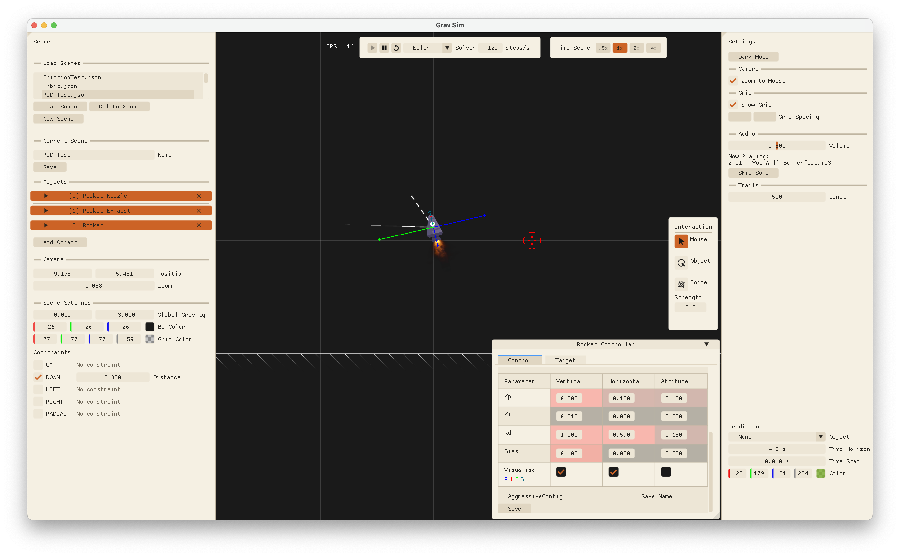
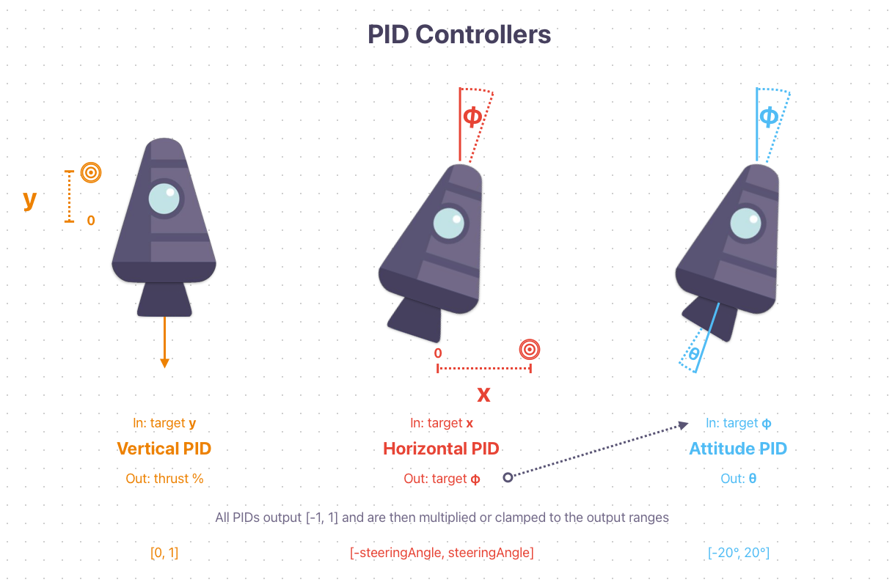

# GravSim  
___
This is a university project written in C++ using GLFW, OpenGL and ImGui.

It features a 2D physics simulation engine with the following features:
- Rigid body dynamics
- Collisions
- Friction
- Constraints
- Gravity

Scenes can be built and simulated in real-time using an ImGui based editor. Cereal is used for saving and loading them.

A screenshot of the editor can be seen below:

___
Built on top of this engine is a simple autonomous rocket simulation using PID control.

An overview of the PID controllers can be seen below:


___
## Cloning
To clone the repository, use the following command:
```bash
git clone --recurse-submodules https://github.com/grav-byte/GravSim.git
```
or if you have already cloned the repository without submodules, run:
```bash
git submodule update --init --recursive
```

## Building
To build the project, you can use CMake

or Visual Studio 2022 by running the following command in the root folder:

```bash
cmake -S . -B build_vs -G "Visual Studio 17 2022"
```
Then open the generated solution file in the `build_vs` folder.

## How to use
The editor works by building scenes with the interface which can then be simulated.

### Building scenes
You can add objects to the scene using the `Add Object` panel on the left side. 
Objects can be configured by opening the dropdowns and setting the desired values.
You can save and load scenes with the menu in the left and there are some pre-made scenes available.
### Running a simulation
To run a simulation, simply click the `Play` button at the top of the window.
You can pause and step through the simulation using the buttons next to it.
The dropdown lets you choose which solver is used to propagate the physics simulation. On the right
of the Simulation UI you can set the time step and time scale.

<span style="color:orange">Any changes made during play mode will be lost when exiting play mode, unless you save the scene while in play mode!</span>

### Autonomous rocket simulation
To use the autonomous rocket simulation, load the `PID` scene and select the `Autnomous PID` control mode in the `Rocket Controller` panel that pops up.
Then you can load PID values by clicking load after selecting a preset PID config from the list.
In the `Target` tab you can configure the target position.
There are already some pre-set so you can just run the simulation.

There is a `visualise` checkbox that will visalise the terms of the various PID controllers.